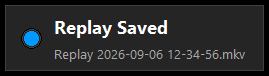
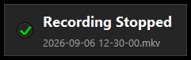

# OBS Replay Buffer Notification

> **Based on [shadowxdgamer/obs_recording_notification](https://github.com/shadowxdgamer/obs_recording_notification).**
> This repository is a rewrite of that script. The visual design and the idea are theirs; the code here was
> restructured after a review found several reliability problems in the original (see [Differences](#differences-from-the-original)).
> If you like the idea, consider [supporting the original author](https://www.buymeacoffee.com/shadowxdgamer).

A small Shadowplay-style popup for OBS Studio on Windows. It appears in a screen corner when the replay buffer is
saved, when recording starts, and when recording stops. It never takes keyboard focus away from your game.





# A real person writing this
Hey, so I pretty much threw this into claude for the specific scenario of having a notification pop up when I saved a Replay Buffer in OBS.

I have not tested anything else, and have zero faith that the other parts decribed below worked.

However, I can confirm that for me, the replay buffer notification does appear when I save a clip.

Also, f*** AMD's software, it's the worst I've ever used.

Jun

## Requirements

| | |
|---|---|
| OS | Windows 10 / 11 |
| OBS Studio | 28.0 or newer. 29.0 or newer to show the saved file name. Tested on 32.2.2. |
| Python | **3.12.10, 64-bit**, installed from python.org with **"tcl/tk and IDLE"** ticked. Tested on 3.12.10; the code is compatible with 3.6 through 3.12. |

Notes on Python:

- OBS 32 loads Python **3.6 through 3.12** only. Python 3.13 and newer will not load, so pick 3.12.x from the
  [python.org downloads list](https://www.python.org/downloads/windows/), not the newest version on the front page.
- The **embeddable zip** does not include tkinter and will not work. Use the normal installer.
- The Python must be 64-bit to match OBS.

## Installation

1. Install Python 3.12.10 (64-bit) from python.org. In the installer choose *Customize installation* and make sure
   *tcl/tk and IDLE* is ticked.
2. Download `obs_recording_notification.py` from this repository.
3. In OBS open **Tools > Scripts**. On the **Python Settings** tab, browse to the Python install folder
   (for example `C:\Users\<you>\AppData\Local\Programs\Python\Python312`).
4. On the **Scripts** tab click **+** and add `obs_recording_notification.py`.
5. Click **Test notification** in the script's settings. A popup should appear. No OBS restart is needed.

## Settings

Available in Tools > Scripts after selecting the script:

- **Display duration (ms)**: how long the popup stays fully visible. Default 3000.
- **Screen corner**: top-left, top-right, bottom-left, bottom-right. Default top-right.
- **Notify: recording started / recording stopped / replay saved**: enable or disable each popup.
- **Notify: replay buffer on/off**: also announce when the replay buffer is started or stopped. Off by default.
- **Show saved file name**: show the clip's file name under the title (OBS 29+).
- **Test notification**: shows a "Replay Saved" popup so you can check the install without recording.

Popups that arrive while one is already on screen are queued and shown one after another. A burst of identical
events is merged into one popup with a count, for example "Replay Saved x3".

## Differences from the original

The original script works for a single replay save after a full OBS restart. This version fixes the cases where it
did not:

| Original | This version |
|---|---|
| Only worked if OBS was restarted after adding the script (it waited for a startup-only event) | Arms itself in `script_load`, so it works the moment it is added |
| Every event added a permanent 100 ms polling loop; a long session ended up waking the thread hundreds of times a second | No polling. One queued callback per event, nothing runs while idle |
| Any event during the 3.6 s animation was silently dropped (two clips saved close together showed one popup) | Events are queued and shown in order; identical bursts are merged with a count |
| Reload Scripts or removing the script leaked the window and thread, and tearing the window down could crash OBS | Clean `script_unload`; reload and removal work; teardown happens on the Tk thread |
| Cross-thread calls into Tk could stall OBS's UI thread for as long as Tk was busy | The OBS thread only ever queues a callback, guarded by a readiness flag, and never raises into OBS |
| Took keyboard focus when the window was first created | Uses the Windows no-activate window style; foreground app is never changed |
| "Recording Started" fired on *starting*, before the output actually began | Fires on *started* |
| "Recording Saved" fired while the file could still be remuxing | Labelled "Recording Stopped" |
| Fixed 200x50 window clipped its own content and broke at DPI scaling | Sized from content, positioned in a configurable corner |
| No settings | Duration, corner, per-event toggles, file name, test button |
| Shipped a 3.6.8 embeddable Python archive that cannot contain tkinter | Points at the standard python.org installer |

The tests folder contains a stubbed `obspython` module and a driver that reproduces each of these scenarios
outside OBS.

## Running the tests

They need a Python with tkinter and pop a real window on screen for a few seconds per scenario.

```bash
cd tests
for s in a b c d e f g obs28 h; do python driver.py $s; echo "exit=$?"; done
```

Every scenario should exit 0. Scenario `h` checks that the foreground window never changes.

## Known limits

- Windows only. The no-activate style and the transparent margin use Win32 features.
- The popup always uses the primary monitor.
- Not tested with OBS's Qt event loop on anything other than the setups listed above. Please open an issue with
  your OBS log if it misbehaves.

## License

MIT, see [LICENSE](LICENSE). The original repository this is based on did not include a license file; attribution
is given above.
